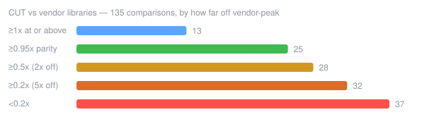

# Benchmarks

Everything that measures CUT lives here: the vendor comparisons that answer *how
far off vendor-peak are we*, the variant sweeps that build the dispatch table,
and the per-operator micro-benchmarks used while optimising a kernel.

The table below is the first question — CUT against the libraries NVIDIA and AMD
ship, on the same shapes, same GPU, same run. It is regenerated from
[`results/history.json`](results/history.json), so every column is a recorded
snapshot rather than a number someone typed in.

## Results — CUT vs vendor libraries

<!-- BENCH:BEGIN -->
*116 comparisons — 15 at or above the vendor, 31 at parity, 41 within 2x, 28 within 5x, 1 beyond; no correctness failures.*

<p></p>

<details>
<summary>🔵 <b>Softmax</b> — vs cuDNN · 1.08x avg (16 cases)</summary>

<table>
<tr><th align="left">benchmark</th><th>2026-08-02<br><sub>1c19721</sub></th><th>2026-07-31<br><sub>9bf5e74</sub></th><th>2026-07-23<br><sub>29fb17d</sub></th></tr>
<tr><td align="left"><code>softmax</code> rows=1 cols=152064</td><td align="center">🔵 <b>2.73x</b> ▲<sub>9891%</sub></td><td align="center">🔴 0.027x</td><td align="center">🔴 0.027x</td></tr>
<tr><td align="left"><code>softmax_large</code> gemma2-27b-logits-1k rows=1024 cols=256000</td><td align="center">🔵 <b>1.82x</b> ▲<sub>2977%</sub></td><td align="center">🔴 0.059x</td><td align="center">—</td></tr>
<tr><td align="left"><code>softmax_large</code> qwen2.5-14b-logits-2k rows=2048 cols=152064</td><td align="center">🔵 <b>1.78x</b> ▲<sub>2166%</sub></td><td align="center">🔴 0.078x</td><td align="center">🔴 0.074x</td></tr>
<tr><td align="left"><code>softmax_large</code> llama3-8b-logits-4k rows=4096 cols=128256</td><td align="center">🔵 <b>1.70x</b> ▲<sub>1576%</sub></td><td align="center">🔴 0.10x</td><td align="center">🔴 0.095x</td></tr>
<tr><td align="left"><code>softmax_large</code> llama3-8b-attn-4k rows=131072 cols=4096</td><td align="center">🔵 <b>1.00x</b> ▲<sub>1283%</sub></td><td align="center">🔴 0.072x</td><td align="center">🔴 0.065x</td></tr>
<tr><td align="left"><code>softmax_large</code> llama3-8b-attn-16k-1h rows=16384 cols=16384</td><td align="center">🟢 <b>1.00x</b> ▲<sub>824%</sub></td><td align="center">🔴 0.11x</td><td align="center">—</td></tr>
<tr><td align="left"><code>softmax_large</code> llama3-8b-attn-8k-8h rows=65536 cols=8192</td><td align="center">🟢 <b>1.00x</b> ▲<sub>846%</sub></td><td align="center">🔴 0.11x</td><td align="center">🔴 0.098x</td></tr>
<tr><td align="left"><code>softmax</code> rows=8192 cols=1024</td><td align="center">🟢 <b>0.99x</b> ▲<sub>2189%</sub></td><td align="center">🔴 0.043x</td><td align="center">🔴 0.040x</td></tr>
<tr><td align="left"><code>softmax</code> rows=32768 cols=256</td><td align="center">🟢 <b>0.98x</b> ▲<sub>2190%</sub></td><td align="center">🔴 0.043x</td><td align="center">🔴 0.040x</td></tr>
<tr><td align="left"><code>softmax</code> rows=4096 cols=512</td><td align="center">🟢 <b>0.98x</b> ▲<sub>2263%</sub></td><td align="center">🔴 0.041x</td><td align="center">🔴 0.039x</td></tr>
<tr><td align="left"><code>softmax_large</code> flux-dit-attn rows=110592 cols=4608</td><td align="center">🟡 <b>0.95x</b> ▲<sub>937%</sub></td><td align="center">🔴 0.091x</td><td align="center">🔴 0.086x</td></tr>
<tr><td align="left"><code>softmax_large</code> sd35-large-attn rows=155648 cols=4096</td><td align="center">🟡 <b>0.95x</b> ▲<sub>1171%</sub></td><td align="center">🔴 0.074x</td><td align="center">🔴 0.070x</td></tr>
<tr><td align="left"><code>softmax</code> rows=32 cols=4096</td><td align="center">🟡 <b>0.91x</b> ▲<sub>4685%</sub></td><td align="center">🔴 0.019x</td><td align="center">🔴 0.019x</td></tr>
<tr><td align="left"><code>softmax</code> rows=1 cols=32000</td><td align="center">🟡 <b>0.68x</b> ▲<sub>5286%</sub></td><td align="center">🔴 0.013x</td><td align="center">🔴 0.013x</td></tr>
<tr><td align="left"><code>softmax</code> rows=8 cols=32000</td><td align="center">🟡 <b>0.68x</b> ▲<sub>2573%</sub></td><td align="center">🔴 0.025x</td><td align="center">🔴 0.025x</td></tr>
<tr><td align="left"><code>softmax</code> rows=4096 cols=128</td><td align="center">🟡 <b>0.67x</b> ▲<sub>2058%</sub></td><td align="center">🔴 0.031x</td><td align="center">🔴 0.030x</td></tr>
</table>
</details>

<details>
<summary>🟢 <b>Transpose</b> — vs cuBLAS · 0.98x avg (15 cases)</summary>

<table>
<tr><th align="left">benchmark</th><th>2026-08-02<br><sub>1c19721</sub></th><th>2026-07-31<br><sub>9bf5e74</sub></th><th>2026-07-23<br><sub>29fb17d</sub></th></tr>
<tr><td align="left"><code>transpose_large</code> qwen2.5-14b-lm-head-w M=152064 N=5120</td><td align="center">🔵 <b>1.01x</b></td><td align="center">🔵 1.01x</td><td align="center">—</td></tr>
<tr><td align="left"><code>transpose_large</code> vit-g14-tokens M=65792 N=1408</td><td align="center">🔵 <b>1.01x</b></td><td align="center">🔵 1.01x</td><td align="center">—</td></tr>
<tr><td align="left"><code>transpose</code> M=8192 N=1024</td><td align="center">🟢 <b>0.99x</b></td><td align="center">🟢 0.98x</td><td align="center">🟡 0.78x</td></tr>
<tr><td align="left"><code>transpose_large</code> act-8k M=8192 N=8192</td><td align="center">🟢 <b>0.99x</b></td><td align="center">🟢 0.98x</td><td align="center">🟡 0.85x</td></tr>
<tr><td align="left"><code>transpose_large</code> act-32k-x-16k M=32768 N=16384</td><td align="center">🟢 <b>0.98x</b></td><td align="center">🟢 0.98x</td><td align="center">🟡 0.85x</td></tr>
<tr><td align="left"><code>transpose</code> M=8192 N=8192</td><td align="center">🟢 <b>0.98x</b></td><td align="center">🟢 0.99x</td><td align="center">🟡 0.79x</td></tr>
<tr><td align="left"><code>transpose</code> M=4096 N=4096</td><td align="center">🟢 <b>0.98x</b></td><td align="center">🟢 1.00x</td><td align="center">🟡 0.80x</td></tr>
<tr><td align="left"><code>transpose_large</code> llama3-8b-lm-head-w M=128256 N=4096</td><td align="center">🟢 <b>0.98x</b> ▼<sub>4%</sub></td><td align="center">🔵 1.03x</td><td align="center">—</td></tr>
<tr><td align="left"><code>transpose_large</code> llama3-8b-qkv-act M=32768 N=4096</td><td align="center">🟢 <b>0.98x</b></td><td align="center">🟢 1.00x</td><td align="center">—</td></tr>
<tr><td align="left"><code>transpose</code> M=1024 N=8192</td><td align="center">🟢 <b>0.98x</b></td><td align="center">🟢 0.98x</td><td align="center">🟡 0.78x</td></tr>
<tr><td align="left"><code>transpose_large</code> llama3-70b-qkv-act M=32768 N=8192</td><td align="center">🟢 <b>0.97x</b></td><td align="center">🟢 0.98x</td><td align="center">—</td></tr>
<tr><td align="left"><code>transpose</code> M=1024 N=1024</td><td align="center">🟢 <b>0.97x</b></td><td align="center">🟢 0.99x</td><td align="center">🟡 0.64x</td></tr>
<tr><td align="left"><code>transpose_large</code> flux-dit-act M=18432 N=3072</td><td align="center">🟢 <b>0.96x</b></td><td align="center">🟢 0.96x</td><td align="center">—</td></tr>
<tr><td align="left"><code>transpose_large</code> act-16k M=16384 N=16384</td><td align="center">🟢 <b>0.96x</b></td><td align="center">🟢 0.98x</td><td align="center">🟡 0.85x</td></tr>
<tr><td align="left"><code>transpose_large</code> act-32k M=32768 N=32768</td><td align="center">🟡 <b>0.94x</b> ▼<sub>6%</sub></td><td align="center">🟢 1.00x</td><td align="center">🟡 0.83x</td></tr>
</table>
</details>

<details>
<summary>🟡 <b>Scan</b> — vs CUB · 0.94x avg (28 cases)</summary>

<table>
<tr><th align="left">benchmark</th><th>2026-08-02<br><sub>1c19721</sub></th><th>2026-07-31<br><sub>9bf5e74</sub></th><th>2026-07-23<br><sub>29fb17d</sub></th></tr>
<tr><td align="left"><code>scan_exclusive</code> mixtral-8x7b-moe-32k N=262144</td><td align="center">🔵 <b>1.02x</b> ▼<sub>5%</sub></td><td align="center">🔵 1.08x</td><td align="center">—</td></tr>
<tr><td align="left"><code>scan_inclusive</code> mixtral-8x7b-moe-32k N=262144</td><td align="center">🔵 <b>1.02x</b></td><td align="center">🔵 1.02x</td><td align="center">—</td></tr>
<tr><td align="left"><code>scan_exclusive</code> gemma2-9b-vocab N=256000</td><td align="center">🔵 <b>1.00x</b> ▼<sub>9%</sub></td><td align="center">🔵 1.10x</td><td align="center">—</td></tr>
<tr><td align="left"><code>scan_inclusive</code> N=16777216</td><td align="center">🟢 <b>0.99x</b></td><td align="center">🟢 0.99x</td><td align="center">🔴 0.043x</td></tr>
<tr><td align="left"><code>scan_inclusive</code> gemma2-9b-vocab N=256000</td><td align="center">🟢 <b>0.99x</b> ▼<sub>5%</sub></td><td align="center">🔵 1.03x</td><td align="center">—</td></tr>
<tr><td align="left"><code>scan_exclusive</code> N=16777216</td><td align="center">🟢 <b>0.99x</b></td><td align="center">🟢 0.99x</td><td align="center">🔴 0.043x</td></tr>
<tr><td align="left"><code>scan_inclusive</code> N=65536</td><td align="center">🟢 <b>0.98x</b> ▼<sub>2%</sub></td><td align="center">🔵 1.00x</td><td align="center">🟠 0.42x</td></tr>
<tr><td align="left"><code>scan_exclusive</code> N=65536</td><td align="center">🟢 <b>0.98x</b> ▼<sub>4%</sub></td><td align="center">🔵 1.02x</td><td align="center">🟠 0.42x</td></tr>
<tr><td align="left"><code>scan_exclusive</code> qwen2.5-14b-vocab N=152064</td><td align="center">🟢 <b>0.97x</b> ▼<sub>4%</sub></td><td align="center">🔵 1.01x</td><td align="center">—</td></tr>
<tr><td align="left"><code>scan_inclusive</code> llama3-8b-batch64-logits N=8208384</td><td align="center">🟢 <b>0.97x</b></td><td align="center">🟢 0.97x</td><td align="center">—</td></tr>
<tr><td align="left"><code>scan_exclusive</code> llama3-8b-batch64-logits N=8208384</td><td align="center">🟢 <b>0.97x</b></td><td align="center">🟢 0.97x</td><td align="center">—</td></tr>
<tr><td align="left"><code>scan_exclusive</code> N=1048576</td><td align="center">🟢 <b>0.96x</b></td><td align="center">🟢 0.97x</td><td align="center">🔴 0.085x</td></tr>
<tr><td align="left"><code>scan_exclusive</code> llama3-8b-vocab N=128256</td><td align="center">🟢 <b>0.96x</b> ▼<sub>4%</sub></td><td align="center">🔵 1.00x</td><td align="center">—</td></tr>
<tr><td align="left"><code>scan_inclusive</code> N=1048576</td><td align="center">🟢 <b>0.95x</b> ▼<sub>3%</sub></td><td align="center">🟢 0.98x</td><td align="center">🔴 0.083x</td></tr>
<tr><td align="left"><code>scan_inclusive</code> llama3-8b-vocab N=128256</td><td align="center">🟢 <b>0.95x</b> ▼<sub>5%</sub></td><td align="center">🔵 1.00x</td><td align="center">—</td></tr>
<tr><td align="left"><code>scan_inclusive</code> qwen2.5-14b-vocab N=152064</td><td align="center">🟢 <b>0.95x</b> ▼<sub>5%</sub></td><td align="center">🟢 1.00x</td><td align="center">—</td></tr>
<tr><td align="left"><code>scan_exclusive</code> qwen2.5-14b-batch32-logits N=4866048</td><td align="center">🟡 <b>0.95x</b></td><td align="center">🟢 0.95x</td><td align="center">—</td></tr>
<tr><td align="left"><code>scan_inclusive</code> qwen2.5-14b-batch32-logits N=4866048</td><td align="center">🟡 <b>0.95x</b></td><td align="center">🟢 0.95x</td><td align="center">—</td></tr>
<tr><td align="left"><code>scan_exclusive</code> N=4194304</td><td align="center">🟡 <b>0.94x</b></td><td align="center">🟡 0.94x</td><td align="center">🔴 0.049x</td></tr>
<tr><td align="left"><code>scan_inclusive</code> N=4194304</td><td align="center">🟡 <b>0.94x</b></td><td align="center">🟡 0.94x</td><td align="center">🔴 0.048x</td></tr>
<tr><td align="left"><code>scan_exclusive</code> mixtral-8x7b-moe-4k N=32768</td><td align="center">🟡 <b>0.90x</b> ▼<sub>5%</sub></td><td align="center">🟡 0.94x</td><td align="center">—</td></tr>
<tr><td align="left"><code>scan_inclusive</code> yolov8-nms-640 N=8400</td><td align="center">🟡 <b>0.89x</b> ▼<sub>4%</sub></td><td align="center">🟡 0.93x</td><td align="center">—</td></tr>
<tr><td align="left"><code>scan_inclusive</code> llama2-7b-vocab N=32000</td><td align="center">🟡 <b>0.89x</b> ▼<sub>4%</sub></td><td align="center">🟡 0.93x</td><td align="center">—</td></tr>
<tr><td align="left"><code>scan_inclusive</code> mixtral-8x7b-moe-4k N=32768</td><td align="center">🟡 <b>0.89x</b> ▼<sub>5%</sub></td><td align="center">🟡 0.94x</td><td align="center">—</td></tr>
<tr><td align="left"><code>scan_exclusive</code> llama2-7b-vocab N=32000</td><td align="center">🟡 <b>0.89x</b> ▼<sub>5%</sub></td><td align="center">🟡 0.93x</td><td align="center">—</td></tr>
<tr><td align="left"><code>scan_exclusive</code> yolov8-nms-640 N=8400</td><td align="center">🟡 <b>0.88x</b> ▼<sub>5%</sub></td><td align="center">🟡 0.92x</td><td align="center">—</td></tr>
<tr><td align="left"><code>scan_exclusive</code> llama3-8b-batch16-logits N=2052096</td><td align="center">🟡 <b>0.85x</b></td><td align="center">🟡 0.86x</td><td align="center">—</td></tr>
<tr><td align="left"><code>scan_inclusive</code> llama3-8b-batch16-logits N=2052096</td><td align="center">🟡 <b>0.85x</b></td><td align="center">🟡 0.86x</td><td align="center">—</td></tr>
</table>
</details>

<details>
<summary>🟡 <b>Sort</b> — vs CUB · 0.94x avg (12 cases)</summary>

<table>
<tr><th align="left">benchmark</th><th>2026-08-02<br><sub>1c19721</sub></th><th>2026-07-31<br><sub>9bf5e74</sub></th><th>2026-07-23<br><sub>29fb17d</sub></th></tr>
<tr><td align="left"><code>sort_radix</code> yolov8-nms-640 N=8400</td><td align="center">🔵 <b>1.19x</b></td><td align="center">—</td><td align="center">—</td></tr>
<tr><td align="left"><code>sort_radix</code> llama2-7b-vocab N=32000</td><td align="center">🔵 <b>1.16x</b></td><td align="center">—</td><td align="center">—</td></tr>
<tr><td align="left"><code>sort_radix</code> mixtral-8x7b-moe-4k N=32768</td><td align="center">🔵 <b>1.16x</b></td><td align="center">—</td><td align="center">—</td></tr>
<tr><td align="left"><code>sort_radix</code> N=65536</td><td align="center">🔵 <b>1.05x</b></td><td align="center">—</td><td align="center">—</td></tr>
<tr><td align="left"><code>sort_radix</code> llama3-8b-vocab N=128256</td><td align="center">🟢 <b>0.97x</b></td><td align="center">—</td><td align="center">—</td></tr>
<tr><td align="left"><code>sort_radix</code> qwen2.5-14b-vocab N=152064</td><td align="center">🟡 <b>0.94x</b></td><td align="center">—</td><td align="center">—</td></tr>
<tr><td align="left"><code>sort_radix</code> llama3-8b-batch64-logits N=8208384</td><td align="center">🟡 <b>0.87x</b></td><td align="center">—</td><td align="center">—</td></tr>
<tr><td align="left"><code>sort_radix</code> llama3-8b-batch16-logits N=2052096</td><td align="center">🟡 <b>0.84x</b></td><td align="center">—</td><td align="center">—</td></tr>
<tr><td align="left"><code>sort_radix</code> gemma2-9b-vocab N=256000</td><td align="center">🟡 <b>0.82x</b></td><td align="center">—</td><td align="center">—</td></tr>
<tr><td align="left"><code>sort_radix</code> N=1048576</td><td align="center">🟡 <b>0.82x</b></td><td align="center">—</td><td align="center">—</td></tr>
<tr><td align="left"><code>sort_radix</code> qwen2.5-14b-batch32-logits N=4866048</td><td align="center">🟡 <b>0.81x</b></td><td align="center">—</td><td align="center">—</td></tr>
<tr><td align="left"><code>sort_radix</code> mixtral-8x7b-moe-32k N=262144</td><td align="center">🟡 <b>0.80x</b></td><td align="center">—</td><td align="center">—</td></tr>
</table>
</details>

<details>
<summary>🟡 <b>Convolution</b> — vs cuDNN · 0.61x avg (11 cases)</summary>

<table>
<tr><th align="left">benchmark</th><th>2026-08-02<br><sub>1c19721</sub></th><th>2026-07-31<br><sub>9bf5e74</sub></th><th>2026-07-23<br><sub>29fb17d</sub></th></tr>
<tr><td align="left"><code>conv2d</code> sam-vit-h-patch-embed N=8 C=3 HW=1024 Cout=1280 k=16 s=16</td><td align="center">🟡 <b>0.84x</b> ▲<sub>2808%</sub></td><td align="center">🔴 0.029x</td><td align="center">—</td></tr>
<tr><td align="left"><code>conv2d</code> vit-g14-patch-embed N=24 C=3 HW=336 Cout=1664 k=14 s=14</td><td align="center">🟡 <b>0.77x</b> ▲<sub>1991%</sub></td><td align="center">🔴 0.037x</td><td align="center">🔴 0.037x</td></tr>
<tr><td align="left"><code>conv2d</code> vit-l14-patch-embed N=32 C=3 HW=224 Cout=1024 k=14 s=14</td><td align="center">🟡 <b>0.76x</b> ▲<sub>1745%</sub></td><td align="center">🔴 0.041x</td><td align="center">🔴 0.042x</td></tr>
<tr><td align="left"><code>conv2d</code> resnet50-stage1-1x1 N=256 C=256 HW=56 Cout=64 k=1 s=1</td><td align="center">🟡 <b>0.75x</b> ▲<sub>2238%</sub></td><td align="center">🔴 0.032x</td><td align="center">🔴 0.032x</td></tr>
<tr><td align="left"><code>conv2d</code> resnet50-stage1-3x3 N=256 C=64 HW=56 Cout=64 k=3 s=1</td><td align="center">🟡 <b>0.62x</b> ▲<sub>1348%</sub></td><td align="center">🔴 0.042x</td><td align="center">🔴 0.043x</td></tr>
<tr><td align="left"><code>conv2d</code> sd-vae-decoder-128ch-2048px N=2 C=128 HW=2048 Cout=128 k=3 s=1</td><td align="center">🟡 <b>0.58x</b> ▲<sub>1764%</sub></td><td align="center">🔴 0.031x</td><td align="center">🔴 0.031x</td></tr>
<tr><td align="left"><code>conv2d</code> sd-vae-decoder-128ch-1024px N=6 C=128 HW=1024 Cout=128 k=3 s=1</td><td align="center">🟡 <b>0.58x</b> ▲<sub>1678%</sub></td><td align="center">🔴 0.033x</td><td align="center">🔴 0.033x</td></tr>
<tr><td align="left"><code>conv2d</code> sd-vae-decoder-512ch N=6 C=512 HW=256 Cout=512 k=3 s=1</td><td align="center">🟡 <b>0.55x</b> ▲<sub>1793%</sub></td><td align="center">🔴 0.029x</td><td align="center">🔴 0.029x</td></tr>
<tr><td align="left"><code>conv2d</code> sdxl-unet-1280ch N=24 C=1280 HW=32 Cout=1280 k=3 s=1</td><td align="center">🟡 <b>0.54x</b> ▲<sub>1320%</sub></td><td align="center">🔴 0.038x</td><td align="center">🔴 0.038x</td></tr>
<tr><td align="left"><code>conv2d</code> sdxl-unet-320ch N=16 C=320 HW=128 Cout=320 k=3 s=1</td><td align="center">🟠 <b>0.47x</b> ▲<sub>1324%</sub></td><td align="center">🔴 0.033x</td><td align="center">🔴 0.033x</td></tr>
<tr><td align="left"><code>conv2d</code> resnet50-stage2-3x3 N=256 C=128 HW=28 Cout=128 k=3 s=1</td><td align="center">🟠 <b>0.41x</b> ▲<sub>1355%</sub></td><td align="center">🔴 0.028x</td><td align="center">🔴 0.028x</td></tr>
</table>
</details>

<details>
<summary>🟠 <b>GEMM / GEMV</b> — vs cuBLAS · 0.38x avg (34 cases)</summary>

<table>
<tr><th align="left">benchmark</th><th>2026-08-02<br><sub>1c19721</sub></th><th>2026-07-31<br><sub>9bf5e74</sub></th><th>2026-07-23<br><sub>29fb17d</sub></th></tr>
<tr><td align="left"><code>sgemm</code> M=128 K=128 N=128</td><td align="center">🔵 <b>1.02x</b> ▼<sub>11%</sub></td><td align="center">🔵 1.15x</td><td align="center">🔵 1.14x</td></tr>
<tr><td align="left"><code>sgemv</code> M=1 K=4096 N=4096</td><td align="center">🟡 <b>0.69x</b></td><td align="center">🟡 0.69x</td><td align="center">🟡 0.70x</td></tr>
<tr><td align="left"><code>sgemv</code> M=1 K=2048 N=2048</td><td align="center">🟡 <b>0.66x</b> ▼<sub>3%</sub></td><td align="center">🟡 0.67x</td><td align="center">🟡 0.67x</td></tr>
<tr><td align="left"><code>sgemm</code> M=4096 K=4096 N=4096</td><td align="center">🟡 <b>0.60x</b></td><td align="center">🟡 0.60x</td><td align="center">🟡 0.60x</td></tr>
<tr><td align="left"><code>sgemm</code> M=2048 K=2048 N=2048</td><td align="center">🟡 <b>0.54x</b> ▼<sub>2%</sub></td><td align="center">🟡 0.55x</td><td align="center">🟡 0.55x</td></tr>
<tr><td align="left"><code>sgemm</code> M=512 K=4096 N=4096</td><td align="center">🟡 <b>0.53x</b> ▼<sub>3%</sub></td><td align="center">🟡 0.54x</td><td align="center">🟡 0.55x</td></tr>
<tr><td align="left"><code>sgemm</code> M=1024 K=1024 N=1024</td><td align="center">🟡 <b>0.52x</b> ▼<sub>12%</sub></td><td align="center">🟡 0.59x</td><td align="center">🟡 0.60x</td></tr>
<tr><td align="left"><code>hgemm</code> M=16 K=4096 N=4096</td><td align="center">🟠 <b>0.41x</b></td><td align="center">🟠 0.41x</td><td align="center">🟠 0.41x</td></tr>
<tr><td align="left"><code>sgemm</code> M=512 K=512 N=512</td><td align="center">🟠 <b>0.40x</b> ▼<sub>10%</sub></td><td align="center">🟠 0.44x</td><td align="center">🟠 0.44x</td></tr>
<tr><td align="left"><code>hgemm</code> M=4096 K=4096 N=4096</td><td align="center">🟠 <b>0.38x</b></td><td align="center">🟠 0.38x</td><td align="center">🟠 0.38x</td></tr>
<tr><td align="left"><code>hgemm</code> M=2048 K=2048 N=2048</td><td align="center">🟠 <b>0.37x</b> ▲<sub>3%</sub></td><td align="center">🟠 0.36x</td><td align="center">🟠 0.36x</td></tr>
<tr><td align="left"><code>sgemv</code> M=1 K=8192 N=8192</td><td align="center">🟠 <b>0.36x</b></td><td align="center">🟠 0.36x</td><td align="center">🟠 0.36x</td></tr>
<tr><td align="left"><code>hgemm_large</code> vit-g14-mlp M=65792 K=1408 N=6144</td><td align="center">🟠 <b>0.36x</b> ▲<sub>3%</sub></td><td align="center">🟠 0.34x</td><td align="center">🟠 0.34x</td></tr>
<tr><td align="left"><code>hgemm_large</code> sd35-large-mlp M=16384 K=2432 N=9728</td><td align="center">🟠 <b>0.35x</b></td><td align="center">🟠 0.35x</td><td align="center">🟠 0.35x</td></tr>
<tr><td align="left"><code>hgemm_large</code> llama3-8b-qkv M=32768 K=4096 N=6144</td><td align="center">🟠 <b>0.35x</b> ▲<sub>2%</sub></td><td align="center">🟠 0.34x</td><td align="center">🟠 0.35x</td></tr>
<tr><td align="left"><code>hgemm_large</code> llama3-8b-ffn-down M=32768 K=14336 N=4096</td><td align="center">🟠 <b>0.35x</b></td><td align="center">🟠 0.35x</td><td align="center">🟠 0.35x</td></tr>
<tr><td align="left"><code>hgemm_large</code> llama2-13b-attn-out M=16384 K=5120 N=5120</td><td align="center">🟠 <b>0.35x</b></td><td align="center">🟠 0.35x</td><td align="center">🟠 0.35x</td></tr>
<tr><td align="left"><code>hgemm_large</code> llama3-70b-qkv M=8192 K=8192 N=10240</td><td align="center">🟠 <b>0.35x</b></td><td align="center">🟠 0.34x</td><td align="center">—</td></tr>
<tr><td align="left"><code>sgemm</code> M=16 K=4096 N=4096</td><td align="center">🟠 <b>0.35x</b></td><td align="center">🟠 0.35x</td><td align="center">🟠 0.35x</td></tr>
<tr><td align="left"><code>hgemm_large</code> flux-dit-mlp M=18432 K=3072 N=12288</td><td align="center">🟠 <b>0.34x</b></td><td align="center">🟠 0.34x</td><td align="center">🟠 0.34x</td></tr>
<tr><td align="left"><code>hgemm_large</code> internvit-6b-mlp M=16384 K=3200 N=12800</td><td align="center">🟠 <b>0.34x</b></td><td align="center">🟠 0.34x</td><td align="center">—</td></tr>
<tr><td align="left"><code>hgemm_large</code> llama3-70b-ffn-down M=8192 K=28672 N=8192</td><td align="center">🟠 <b>0.34x</b></td><td align="center">🟠 0.34x</td><td align="center">—</td></tr>
<tr><td align="left"><code>hgemm_large</code> llama3-70b-ffn-up M=8192 K=8192 N=57344</td><td align="center">🟠 <b>0.33x</b> ▲<sub>2%</sub></td><td align="center">🟠 0.33x</td><td align="center">—</td></tr>
<tr><td align="left"><code>hgemm_large</code> llama3-8b-ffn-up M=32768 K=4096 N=28672</td><td align="center">🟠 <b>0.33x</b> ▲<sub>2%</sub></td><td align="center">🟠 0.33x</td><td align="center">🟠 0.33x</td></tr>
<tr><td align="left"><code>hgemm_large</code> llama2-13b-ffn-up M=16384 K=5120 N=27648</td><td align="center">🟠 <b>0.33x</b> ▲<sub>2%</sub></td><td align="center">🟠 0.32x</td><td align="center">🟠 0.33x</td></tr>
<tr><td align="left"><code>hgemm_large</code> gemma2-27b-ffn-up M=8192 K=4608 N=73728</td><td align="center">🟠 <b>0.33x</b> ▲<sub>3%</sub></td><td align="center">🟠 0.32x</td><td align="center">—</td></tr>
<tr><td align="left"><code>hgemm</code> M=1024 K=1024 N=1024</td><td align="center">🟠 <b>0.33x</b></td><td align="center">🟠 0.33x</td><td align="center">🟠 0.32x</td></tr>
<tr><td align="left"><code>hgemm_large</code> qwen2.5-14b-lm-head M=2048 K=5120 N=152064</td><td align="center">🟠 <b>0.33x</b> ▲<sub>3%</sub></td><td align="center">🟠 0.32x</td><td align="center">🟠 0.32x</td></tr>
<tr><td align="left"><code>hgemm_large</code> llama3-70b-lm-head M=2048 K=8192 N=128256</td><td align="center">🟠 <b>0.33x</b> ▲<sub>2%</sub></td><td align="center">🟠 0.32x</td><td align="center">—</td></tr>
<tr><td align="left"><code>hgemm_large</code> llama3-8b-lm-head M=4096 K=4096 N=128256</td><td align="center">🟠 <b>0.32x</b> ▲<sub>2%</sub></td><td align="center">🟠 0.32x</td><td align="center">🟠 0.32x</td></tr>
<tr><td align="left"><code>hgemm</code> M=512 K=4096 N=4096</td><td align="center">🟠 <b>0.32x</b></td><td align="center">🟠 0.31x</td><td align="center">🟠 0.31x</td></tr>
<tr><td align="left"><code>hgemm</code> M=1 K=4096 N=4096</td><td align="center">🟠 <b>0.30x</b> ▲<sub>3%</sub></td><td align="center">🟠 0.30x</td><td align="center">⚠️<br><sub>mismatch</sub></td></tr>
<tr><td align="left"><code>hgemm_large</code> llama3-8b-ffn-up-xl M=65536 K=4096 N=28672</td><td align="center">🟠 <b>0.26x</b> ▼<sub>20%</sub></td><td align="center">🟠 0.33x</td><td align="center">🟠 0.33x</td></tr>
<tr><td align="left"><code>hgemm</code> M=1 K=8192 N=8192</td><td align="center">🔴 <b>0.13x</b><br><sub>8x slower</sub></td><td align="center">🔴 0.13x</td><td align="center">⚠️<br><sub>mismatch</sub></td></tr>
</table>
</details>

<sub>Measured on <b>NVIDIA GeForce RTX 3090</b> · newest column 2026-08-02 (<code>1c19721</code>) · absolute timings for every case are in <a href="results/history.json">results/history.json</a></sub>

<!-- BENCH:END -->
**Cells are speedup — vendor time ÷ CUT time — so bigger is better.** `2.00x` is
twice the vendor's speed, `0.50x` is half of it, `1.00x` is parity. Same
convention `vendor_compare.py` prints on the command line.

🔵 **≥1x — matches or beats the vendor** · 🟢 ≥0.95x parity · 🟡 ≥0.5x (within 2x)
· 🟠 ≥0.2x (within 5x) · 🔴 <0.2x · ⚠️ output disagreed with the reference
(timing not quotable)

Each family's figure is the geometric mean of its cases. Families and rows are
ordered best first; open a family for its per-shape table.

Newest snapshot is the **leftmost** column. ▲ on it means CUT got faster since
the previous column; movement under ±2% is hidden.

## Reproducing

```bash
./scripts/bench/vendor_bench.sh --quick        # build + run every vendor pair
python3 scripts/bench/render_bench.py --snapshot   # record a column, redraw this page
```

`--quick` skips the two largest `sort_radix` sizes, which otherwise dominate the
wall time; `--no-large` additionally drops the model-scale cases that hold up to
20 GB of VRAM. Cases that do not fit the card are skipped automatically. A run
that a vendor SDK is missing for is skipped rather than failed, and shows up as
blank cells rather than a missing page.

`vendor_bench.sh` rebuilds its targets by default, and that matters: every
benchmark binary compiles in the operator variant table and reads
`tuning_data.json` by index at runtime, so a stale binary silently measures a
different kernel than the one you think you are testing.

## What else is here

| path | what it measures | reference |
|---|---|---|
| [`vendor/`](vendor/README.md) | operator vs cuBLAS / cuDNN / CUB / rocBLAS / rocPRIM | external, absolute |
| [`autotune/`](autotune/) | CUT's own shader variants against each other, to derive `tuning_data.json` | internal, relative |
| [`op_bench.cpp`](op_bench.cpp) | per-operator, per-variant GPU timestamps → JSON | internal |
| [`benchmark.cpp`](benchmark.cpp) | end-to-end operator timings from the public API | internal |

Model-level comparisons live in [`scripts/bench/`](../scripts/bench/):
`benchmark_gpus.py` (CUT vs llama.cpp on every GPU in the box),
`benchmark_compare.py` (single device), `benchmark_memory.py` (RSS + VRAM), and
`interface/python/benchmarks/run_benchmarks.py` (CUT vs PyTorch, CuPy, JAX,
TensorFlow, Warp).

Methodology — how each pair is timed, how correctness is gated, and how to add an
operator — is in [`vendor/README.md`](vendor/README.md).
